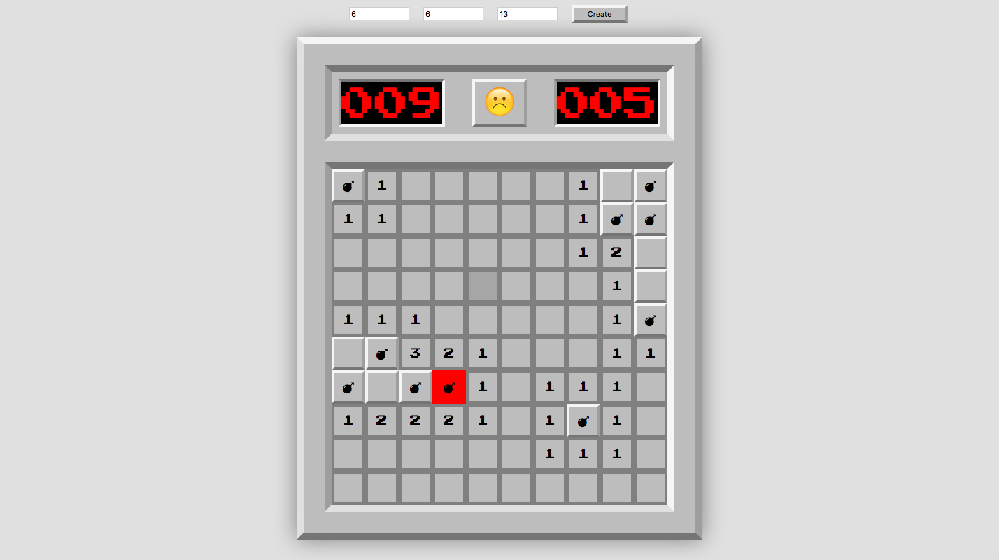

# Minesweeper

This project was bootstrapped with [Create React App]
and deploy with [Surge]

> NOTE: This functional React [Minesweeper] is still in progress.

## Tech/framework used

Built with:
* [React] with [functional, stateless components]
* TODO: add [Immutable-js] and [persistent data structure]
* Vanilla CSS
* ES6 with Babel

## Credits

[Pablo Jurado](http://www.pablojurado.com)

[Create React App]:(https://github.com/facebookincubator/create-react-app)
[Surge]:(http://surge.sh/)
[Minesweeper]:https://en.wikipedia.org/wiki/Minesweeper_(video_game)
[React]:https://facebook.github.io/react/
[functional, stateless components]:https://facebook.github.io/react/docs/components-and-props.html#props-are-read-only
[Firebase]:https://firebase.google.com/
[persistent data structure]:https://en.wikipedia.org/wiki/Persistent_data_structure
[Immutable-js]:https://facebook.github.io/immutable-js/
